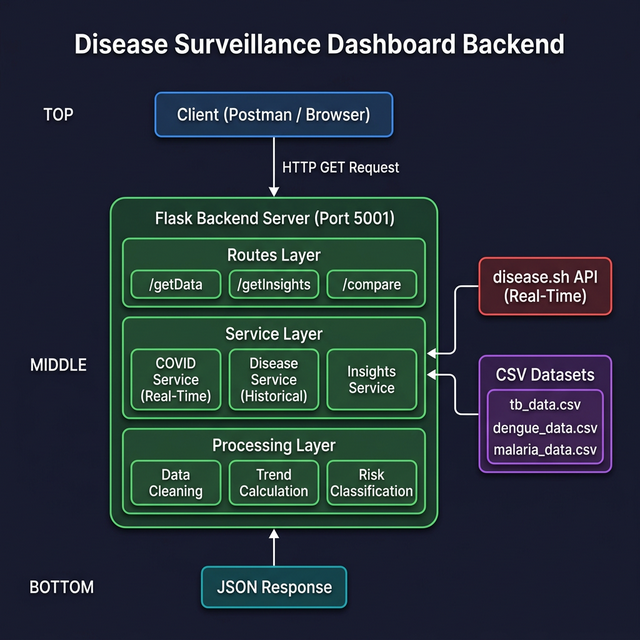
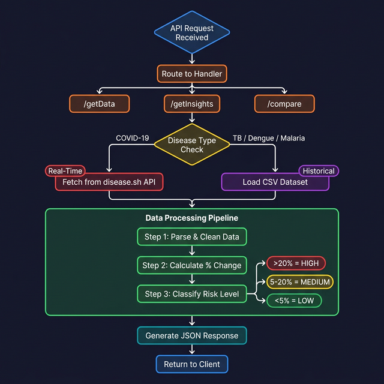

# HealthScope Backend

A robust Flask-based backend system that integrates real-time COVID-19 data with historical datasets...

> [!NOTE]
> COVID-19 data is fetched in real-time using public APIs, while other diseases use historical datasets.

## Architecture



```
Client (Postman/Browser)
        │
        ▼
   API Request (HTTP GET)
        │
        ▼
┌──────────────────────────────┐
│   Flask Backend Server       │
│   (app.py - Port 5000)       │
│                              │
│   ┌────────────────────────┐ │
│   │   Routes Layer         │ │
│   │   /getData             │ │
│   │   /getInsights         │ │
│   │   /compare             │ │
│   └─────────┬──────────────┘ │
│             │                │
│   ┌─────────▼──────────────┐ │
│   │   Service Layer        │ │
│   │                        │ │
│   │ ┌──────────────────┐   │ │
│   │ │ covid_service    │───┼─┼──► disease.sh API (Real-Time)
│   │ └──────────────────┘   │ │
│   │ ┌──────────────────┐   │ │
│   │ │ disease_service  │───┼─┼──► CSV Datasets (Historical)
│   │ └──────────────────┘   │ │    ├── tb_data.csv
│   │ ┌──────────────────┐   │ │    ├── dengue_data.csv
│   │ │ insights_service │   │ │    └── malaria_data.csv
│   │ └──────────────────┘   │ │
│   └─────────┬──────────────┘ │
│             │                │
│   ┌─────────▼──────────────┐ │
│   │   Processing Layer     │ │
│   │   • Data cleaning      │ │
│   │   • Trend calculation  │ │
│   │   • Risk classification│ │
│   └────────────────────────┘ │
└──────────────┬───────────────┘
               │
               ▼
        JSON Response
```

## Tech Stack

| Technology | Purpose |
|---|---|
| Python 3 | Backend language |
| Flask | Web framework & REST API |
| Pandas | Data loading & processing |
| Requests | Real-time API calls |
| Flask-CORS | Cross-origin support |

## Project Structure

```
disease-surveillance-backend/
├── app.py                      # Flask entry point
├── requirements.txt            # Python dependencies
├── data/
│   ├── tb_data.csv             # TB historical data (2020-2025)
│   ├── dengue_data.csv         # Dengue historical data (2020-2025)
│   └── malaria_data.csv        # Malaria historical data (2020-2025)
├── services/
│   ├── __init__.py
│   ├── covid_service.py        # Real-time COVID-19 API integration
│   ├── disease_service.py      # Historical CSV data processing
│   └── insights_service.py     # Insights & comparison logic
├── routes/
│   ├── __init__.py
│   └── api_routes.py           # API endpoint definitions
└── README.md
```

## Setup & Installation

### Prerequisites
- Python 3.8+

### Steps

```bash
# 1. Clone the repository
git clone <repository-url>
cd healthscope-backend

# 2. Create virtual environment
python3 -m venv venv
source venv/bin/activate        # macOS/Linux
# venv\Scripts\activate         # Windows

# 3. Install dependencies
pip install -r requirements.txt

# 4. Run the server
python app.py
```

The server starts on **http://localhost:5000**

## API Endpoints

### 1. `GET /getData?disease=<name>`

Retrieve disease data with statistics, time-series, and risk classification.

**Parameters:** `disease` — one of `covid`, `tb`, `dengue`, `malaria`

**Example:**
```bash
curl "http://localhost:5000/getData?disease=covid"
```

**Response:**
```json
{
  "status": "success",
  "data": {
    "disease": "COVID-19",
    "source": "disease.sh (Real-Time API)",
    "data_type": "real-time",
    "statistics": {
      "total_cases": 704753890,
      "deaths": 7010681,
      "percentage_change_30d": 0.02,
      "trend": "increasing",
      "risk_level": "Low"
    },
    "time_series": [...]
  }
}
```

### 2. `GET /getInsights?disease=<name>`

Get trend analysis, risk assessment, and public health recommendations.

**Example:**
```bash
curl "http://localhost:5000/getInsights?disease=dengue"
```

**Response:**
```json
{
  "status": "success",
  "insights": {
    "disease": "Dengue",
    "trend_analysis": {
      "direction": "increasing",
      "percentage_change": 13.67,
      "description": "Dengue cases show a moderate increase..."
    },
    "risk_assessment": {
      "level": "Medium",
      "description": "WARNING: Moderate case increase observed..."
    },
    "recommendations": [
      "Enhance disease surveillance in affected areas",
      "Implement vector control measures..."
    ]
  }
}
```

### 3. `GET /compare?disease1=<name>&disease2=<name>`

Compare two diseases side-by-side with relative analysis.

**Example:**
```bash
curl "http://localhost:5000/compare?disease1=covid&disease2=malaria"
```

**Response:**
```json
{
  "status": "success",
  "comparison": {
    "summary": "Comparing COVID-19 and Malaria: ...",
    "diseases": {
      "COVID-19": { "total_cases": "...", "risk_level": "..." },
      "Malaria": { "total_cases": "...", "risk_level": "..." }
    },
    "relative_analysis": {
      "higher_cases": "COVID-19",
      "higher_mortality": "Malaria",
      "higher_risk": "..."
    }
  }
}
```

### 4. `GET /`

Returns API documentation including all available endpoints.

## Data Sources

| Disease | Source | Type |
|---|---|---|
| COVID-19 | [disease.sh](https://disease.sh/) API | Real-Time |
| Tuberculosis | `data/tb_data.csv` | Historical (2020–2025) |
| Dengue | `data/dengue_data.csv` | Historical (2020–2025) |
| Malaria | `data/malaria_data.csv` | Historical (2020–2025) |

## Risk Level Classification

| Risk Level | Condition |
|---|---|
| **High** | >20% case increase |
| **Medium** | 5–20% case increase |
| **Low** | <5% increase or stable |

## Key Features

- **Real-time Data Fetching** — Live COVID-19 data from disease.sh public API
- **Historical Data Processing** — CSV-based datasets for TB, Dengue, Malaria
- **Trend Analysis** — Percentage change calculation over configurable periods
- **Risk Classification** — Automatic High/Medium/Low risk assignment
- **Disease Comparison** — Side-by-side analysis with relative metrics
- **Modular Architecture** — Clean separation of routes, services, and data

## Data Flowchart



## License

MIT License
