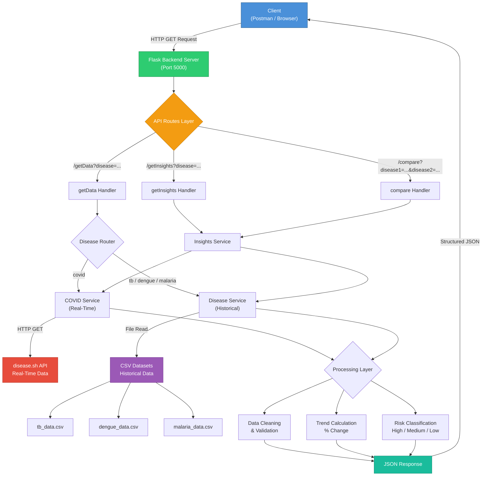

# Architecture Flowchart

## System Architecture Diagram

## Data Flow Description

### 1. Request Phase
- Client sends HTTP GET request to one of the three API endpoints
- Flask routes the request to the appropriate handler

### 2. Data Retrieval Phase
- **COVID-19**: Fetches live data from `disease.sh/v3/covid-19/all` and `/historical/all`
- **TB / Dengue / Malaria**: Loads data from CSV files using Pandas

### 3. Processing Phase
- **Data Cleaning**: Parse dates, handle missing values, sort chronologically
- **Trend Calculation**: Compute percentage change over recent periods
- **Risk Classification**: Assign High (>20%), Medium (5-20%), Low (<5%) risk levels

### 4. Response Phase
- Returns structured JSON with total cases, deaths, time-series, trends, and risk levels
